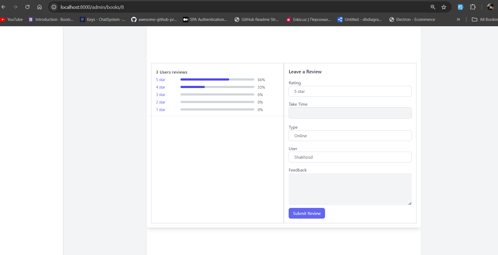

<p align="center"><a href="https://laravel.com" target="_blank"></a></p>

# Book Recommendation System

This is a Book Recommendation System API with an accompanying admin panel, built using Laravel. The admin panel is designed with Blade templates, allowing administrators to manage books, users, and recommendations.

## Features

- **API Endpoints:**
    - Book management (add, update, delete, download books)
    - User management (registration, authentication)
    - Book recommendation engine based on user preferences
- **Admin Panel:**
    - Manage books, categories, roles and authors
    - View and manage user recommendations

## Technologies Used

- **Backend:**
    - Laravel Framework
    - MySQL 
    - Blade templating engine for the admin panel
    - Tailwind CSS
- **Authentication:**
    - Laravel Sanctum 

## Installation

   ```bash
    # Clone the repository
    git clone https://github.com/Shakhzod0307/book-recomandation-system-api.git
   
    # Navigate to the project directory 
    cd book-recommendation-system-api
   
    # Install dependencies
    composer install
    
    # Copy the example env file and make the required configuration changes
    cp .env.example .env
    
    # Generate an application key
    php artisan key:generate
    
    # Run the migrations
    php artisan migrate --seed
   
    # Serve the application
    php artisan serve
    
   ```
### Access the admin panel:    

- **Visit http://localhost:8000**
- **Default admin credentials:**
    - Email: admin@admin.com
    - Password: admin123


# Some screenshots





